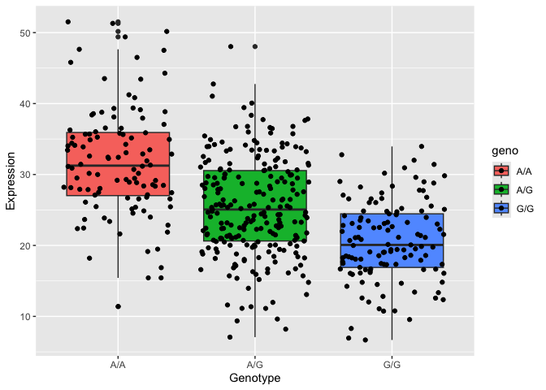

# HW 12: Population Scale Analysis
Daniel Kim

> Q13: Read this file into R and determine the sample size for each
> genotype and their corresponding median expression levels for each of
> these genotypes.

``` r
file <- read.table("data.txt", header = TRUE)
```

``` r
summary(file)
```

        sample              geno                exp        
     Length:462         Length:462         Min.   : 6.675  
     Class :character   Class :character   1st Qu.:20.004  
     Mode  :character   Mode  :character   Median :25.116  
                                           Mean   :25.640  
                                           3rd Qu.:30.779  
                                           Max.   :51.518  

``` r
table(file$geno)
```


    A/A A/G G/G 
    108 233 121 

``` r
median(file$exp[file$geno == "A/A"])
```

    [1] 31.24847

``` r
median(file$exp[file$geno == "A/G"])
```

    [1] 25.06486

``` r
median(file$exp[file$geno == "G/G"])
```

    [1] 20.07363

Sample size of 108 for A/A, 233 for A/G and 121 for G/G. Median
expression level of 31.24847 for A/A, 25.06486 for A/G, and 20.073673
for G/G.

> Q14: Generate a boxplot with a box per genotype, what could you infer
> from the relative expression value between A/A and G/G displayed in
> this plot? Does the SNP effect the expression of ORMDL3?

``` r
library(ggplot2)

ggplot(file, aes(x = geno, y = exp, fill = geno)) +
  geom_boxplot() +
  geom_jitter() +
  labs(x = "Genotype", y = "Expression")
```



A/A shows the highest median expression levels and A/G lower, and G/G
lowest. It seems like each additional G allele decreases the expression
levels of the ORMDL3 gene. Yes it does affect the expression.
