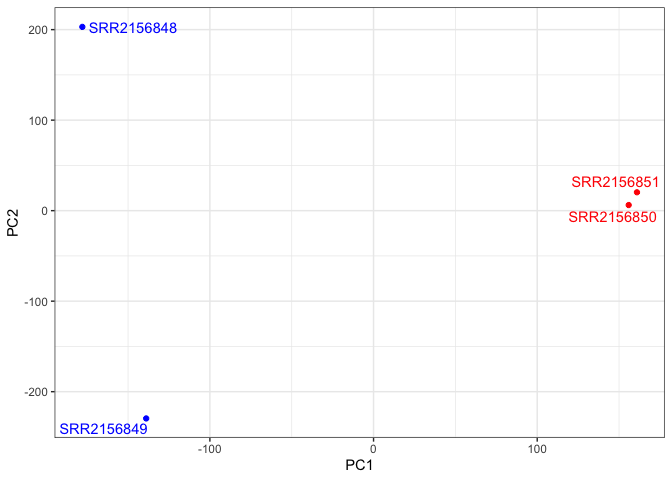
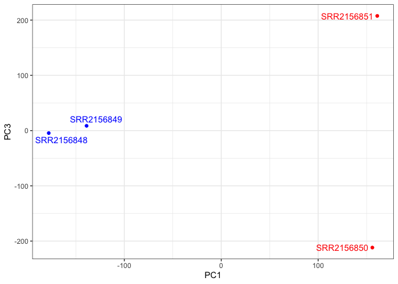
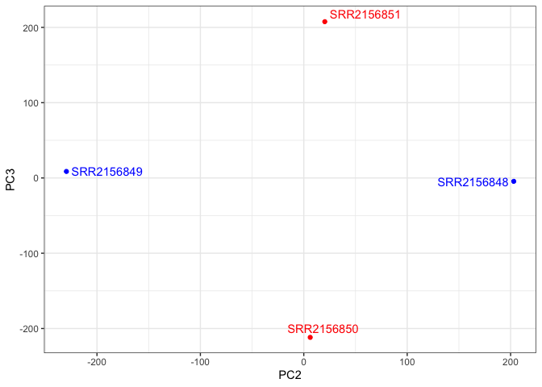

# Class 17: Analyzing Sequence Data in the Cloud
Daniel Kim

## The Sequence Read Archive (SRA)

> Q. What shell command can you use to view the top few files of your
> FASTQ file?

You can use head to view the top few files.

> Q. What length are these sequence reads?

38. 

> Q. Can you use the grep command to determine how many total reads are
> in this file?

Yes: grep -c “@SRR600956” SRR600956.fastq

> Q. Does you number of reads from grep match the name of the last read
> in the file? If not why not?

Yes it matches.

## Working with RNA-Seq data

> Q. How would you check that these files with extension ‘.fastq’
> actually look like what we expect for a FASTQ file? You could try
> printing the first few lines to the shell standard output:

We use the command head

> Q. How could you check the number of sequences in each file?

We use the command grep -c “@SRR2156848” SRR2156848_1.fastq

> Q. Check your answer with the bottom of the file using the tail
> command and also check the matching mate pair FASTQ file. Do these
> numbers match? If so why or why not?

Yes, they match.

> Q. Download the other 3 datasets (SRR2156849, SRR2156850 and
> SRR2156851) we need for our analysis, first with prefetch and then
> process with fasterq-dump

Done.

> Q. Check you have pairs of FASTQ files for all four datasets and that
> they have the same number of counts in each pair?

Done.

## Transcript quantification via pseudoalignment

> Q. Can you run kallisto to print out its citation information?

kallisto cite.

## Check your results

> Q. Have a look at the TSV format versions of these files to understand
> their structure. What do you notice about these files contents?

It’s in a structured format with target_id, length, eff_length, and
est_counts, tpm. Most est_counts are 0 and very few higher in the 0-2
range.

## Downstream analysis

``` r
library(tximport)

# setup the folder and file-names to read
folders <- dir(pattern="SRR21568*")
samples <- sub("_quant", "", folders)
files <- file.path( folders, "abundance.h5" )
names(files) <- samples

txi.kallisto <- tximport(files, type = "kallisto", txOut = TRUE)
```

    1 2 3 4 

``` r
head(txi.kallisto$counts)
```

                    SRR2156848 SRR2156849 SRR2156850 SRR2156851
    ENST00000539570          0          0    0.00000          0
    ENST00000576455          0          0    2.62037          0
    ENST00000510508          0          0    0.00000          0
    ENST00000474471          0          1    1.00000          0
    ENST00000381700          0          0    0.00000          0
    ENST00000445946          0          0    0.00000          0

``` r
colSums(txi.kallisto$counts)
```

    SRR2156848 SRR2156849 SRR2156850 SRR2156851 
       2563611    2600800    2372309    2111474 

``` r
sum(rowSums(txi.kallisto$counts)>0)
```

    [1] 94561

``` r
to.keep <- rowSums(txi.kallisto$counts) > 0
kset.nonzero <- txi.kallisto$counts[to.keep,]
```

``` r
keep2 <- apply(kset.nonzero,1,sd)>0
x <- kset.nonzero[keep2,]
```

## Principal Component Analysis

``` r
pca <- prcomp(t(x), scale=TRUE)
```

``` r
summary(pca)
```

    Importance of components:
                                PC1      PC2      PC3   PC4
    Standard deviation     183.6379 177.3605 171.3020 1e+00
    Proportion of Variance   0.3568   0.3328   0.3104 1e-05
    Cumulative Proportion    0.3568   0.6895   1.0000 1e+00

``` r
plot(pca$x[,1], pca$x[,2],
     col=c("blue","blue","red","red"),
     xlab="PC1", ylab="PC2", pch=16)
```


> Q. Use ggplot to make a similar figure of PC1 vs PC2 and a separate
> figure PC1 vs PC3 and PC2 vs PC3.

``` r
library(ggplot2)
library(ggrepel)

mycols <- c("blue","blue","red","red")

ggplot(pca$x) +
  aes(PC1, PC2, label=rownames(pca$x)) +
  geom_point( col=mycols ) +
  geom_text_repel( col=mycols ) +
  theme_bw()
```



``` r
ggplot(pca$x) +
  aes(PC1, PC3, label=rownames(pca$x)) +
  geom_point(col=mycols) +
  geom_text_repel(col=mycols) +
  theme_bw()
```



``` r
ggplot(pca$x) +
  aes(PC2, PC3, label=rownames(pca$x)) +
  geom_point(col=mycols) +
  geom_text_repel(col=mycols) +
  theme_bw()
```


