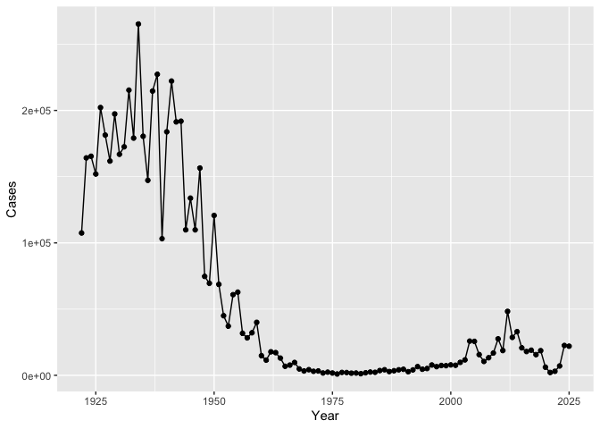
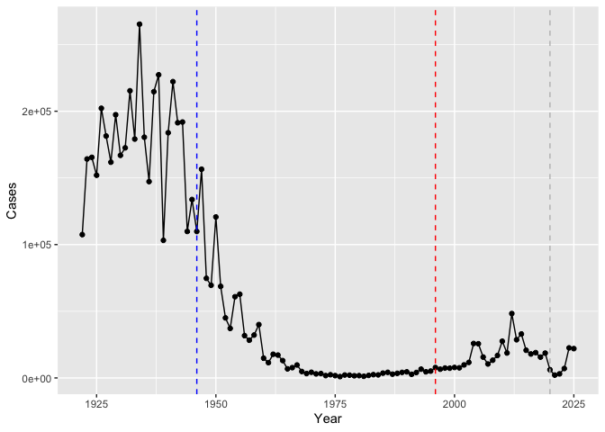
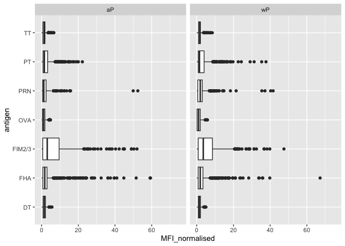
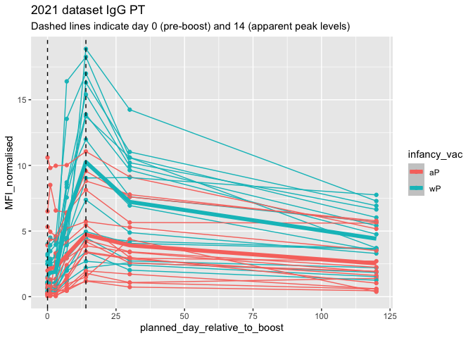

# Class 18: Pertussis Mini-Project
Daniel Kim

``` r
library(ggplot2)
```

> Q1. With the help of the R “addin” package datapasta assign the CDC
> pertussis case number data to a data frame called cdc and use ggplot
> to make a plot of cases numbers over time.

``` r
ggplot(cdc) +
  aes(Year, Cases) +
  geom_point() +
  geom_line() +
  labs(x="Year", y="Cases")
```



> Q2. Using the ggplot geom_vline() function add lines to your previous
> plot for the 1946 introduction of the wP vaccine and the 1996 switch
> to aP vaccine (see example in the hint below). What do you notice?

``` r
ggplot(cdc) +
  aes(Year, Cases) +
  geom_point() +
  geom_line() +
  geom_vline(xintercept = 1946, col = "blue", lty = 2) +
  geom_vline(xintercept = 1996, col = "red", lty = 2) +
  geom_vline(xintercept = 2020, col = "gray", lty = 2) +
  labs(x="Year", y="Cases")
```



After the roll out of the wP vaccine in 1946, cases steadily declined.
After the switch to the aP vaccine, the cases could be going up because
of better testing, less vaccinations, and vaccine resistance. The aP
vaccine also weins off faster than the wP vaccine.

``` r
library(jsonlite)
```

``` r
subject <- read_json("https://www.cmi-pb.org/api/subject", simplifyVector = TRUE) 
```

> Q4. How many aP and wP infancy vaccinated subjects are in the dataset?

``` r
table(subject$infancy_vac)
```


    aP wP 
    87 85 

> Q5. How many Male and Female subjects/patients are in the dataset?

``` r
table(subject$biological_sex)
```


    Female   Male 
       112     60 

> Q6. What is the breakdown of race and biological sex (e.g. number of
> Asian females, White males etc…)?

``` r
table(subject$race, subject$biological_sex)
```

                                               
                                                Female Male
      American Indian/Alaska Native                  0    1
      Asian                                         32   12
      Black or African American                      2    3
      More Than One Race                            15    4
      Native Hawaiian or Other Pacific Islander      1    1
      Unknown or Not Reported                       14    7
      White                                         48   32

``` r
# Complete the API URLs...
specimen <- read_json("http://cmi-pb.org/api/v5_1/specimen", simplifyVector = TRUE) 
titer <- read_json("http://cmi-pb.org/api/v5_1/plasma_ab_titer", simplifyVector = TRUE) 
```

``` r
library(dplyr)
```


    Attaching package: 'dplyr'

    The following objects are masked from 'package:stats':

        filter, lag

    The following objects are masked from 'package:base':

        intersect, setdiff, setequal, union

``` r
meta <- inner_join(subject, specimen)
```

    Joining with `by = join_by(subject_id)`

``` r
abdata <- inner_join(titer, meta)
```

    Joining with `by = join_by(specimen_id)`

> Q11. How many specimens (i.e. entries in abdata) do we have for each
> isotype?

``` r
table(abdata$isotype)
```


      IgE   IgG  IgG1  IgG2  IgG3  IgG4 
     6698  7265 11993 12000 12000 12000 

> Q. How many different “antigen” values are measured?

``` r
table(abdata$antigen)
```


        ACT   BETV1      DT   FELD1     FHA  FIM2/3   LOLP1     LOS Measles     OVA 
       1970    1970    6318    1970    6712    6318    1970    1970    1970    6318 
        PD1     PRN      PT     PTM   Total      TT 
       1970    6712    6712    1970     788    6318 

``` r
igg <- abdata %>% filter(isotype == "IgG")
```

``` r
ggplot(igg) +
  aes(MFI_normalised, antigen) +
  geom_boxplot() + 
    xlim(0,75) +
  facet_wrap(~infancy_vac)
```

    Warning: Removed 5 rows containing non-finite outside the scale range
    (`stat_boxplot()`).



``` r
ggplot(igg) + 
  aes(MFI_normalised, antigen, col = infancy_vac) +
  geom_boxplot() +
  facet_wrap(~visit)
```


``` r
abdata.21 <- abdata %>% filter(dataset == "2021_dataset")

abdata.21 %>% 
  filter(isotype == "IgG",  antigen == "PT") %>%
  ggplot() +
    aes(x=planned_day_relative_to_boost,
        y=MFI_normalised,
        col=infancy_vac,
        group=subject_id) +
    geom_point() +
    geom_line() +
    stat_summary(fun = mean, geom = "smooth", linewidth = 2, aes(group = infancy_vac, col = infancy_vac)) +
    geom_vline(xintercept=0, linetype="dashed") +
    geom_vline(xintercept=14, linetype="dashed") +
  labs(title="2021 dataset IgG PT",
       subtitle = "Dashed lines indicate day 0 (pre-boost) and 14 (apparent peak levels)")
```

    Warning in max(ids, na.rm = TRUE): no non-missing arguments to max; returning
    -Inf
    Warning in max(ids, na.rm = TRUE): no non-missing arguments to max; returning
    -Inf


